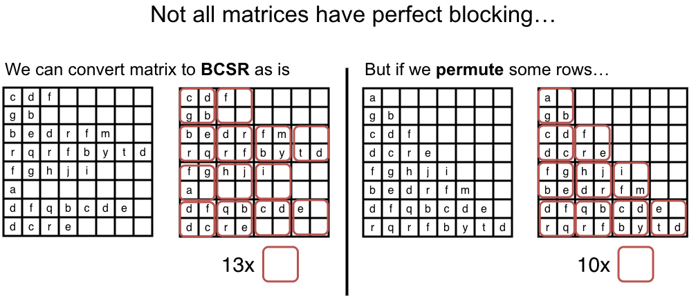
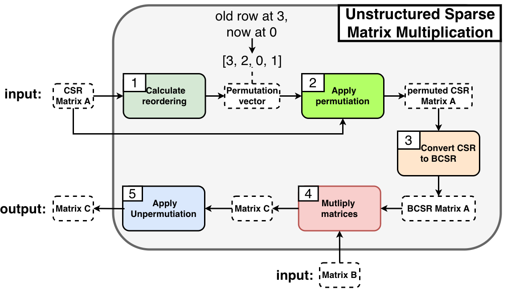

# xSpMM (Cross-Platform Sparse Matrix Multiplication)

**xSpMM** is a high-performance, cross-platform C++ library designed to accelerate Unstructured Sparse Matrix-Dense Matrix Multiplication (SpMM) on hardware Matrix Cores (AMD MFMA and NVIDIA WMMA Tensor Cores).

Traditional sparse formats (like CSR) perform poorly on these hardware units because they are designed for dense data chunks (e.g., 16x16 tiles). xSpMM optimizes unstructured matrices by leveraging row reordering algorithms (Sylos Labini/1D Jaccard Clustering) to force non-zero elements into dense clusters. This reordering maximizes hardware block occupancy, significantly increasing throughput (TFLOPS) compared to standard vendor libraries on irregular sparsity patterns.

## How It Works

### 1. The Motivation: Pattern Reordering
Not all matrices have natural blocking. Converting an irregular matrix directly to BCSR results in excessive zero-padding inside the blocks, leading to wasted memory and wasted computations. xSpMM permutes the rows to group non-zeros together, mathematically shrinking the optimized BCSR footprint.



### 2. The Automated Pipeline
For standard users, this complex optimization is fully abstracted. The library provides an automated pipeline that accepts standard CSR input and handles the rest.


---

## Getting Started

### Prerequisites / Required Tools
* **CMake 3.24+** (Required for native CUDA/HIP language support).
* A C++20 compatible host compiler (GCC/Clang/MSVC).
* **For AMD GPUs**: ROCm Toolkit (including `hipcc` and `rocsparse`).
* **For NVIDIA GPUs**: CUDA Toolkit (including `nvcc` and `cusparse`).

xSpMM natively supports Multi-Precision workloads (e.g., `__half` inputs for sparse matrix `A` and dense matrix `B`, with `float` output for matrix `C`).

---

### Commands to Build

**For AMD (HIP) Backend:**
To build on AMD CDNA architectures (e.g., MI210, MI250X):

```bash
make release-hip
```

**For NVIDIA (CUDA) Backend:**

```bash
make release-cuda
```

---

## Simple Quick Start

The Tier 2 pipeline provides a simple, unified interface that completely abstracts the underlying hardware and BCSR format requirements from the user.

```cpp
#include <iostream>
#include <vector>
#include <xspmm/xspmm.hpp>
#include <xspmm/core/executor.hpp>

int main() {
    // 1. SELECT HARDWARE EXECUTOR
    // Note: To run on AMD devices, simply swap CudaExecutor for HipExecutor.
    auto exec = std::make_shared<xspmm::CudaExecutor>(0);

    // 2. LOAD UNOPTIMIZED CSR DATA (Host std::vectors)
    int M = 1024; int K = 1024; int N = 1024; int nnz = ...;
    std::vector<int> row_ptr = ...; 
    std::vector<int> col_ind = ...; 
    std::vector<float> values = ...;

    // Load to Device Memory via RAII-managed CSRMatrix
    xspmm::CSRMatrix<float, int> A(exec, M, K, nnz);
    A.copy_from_host(row_ptr.data(), col_ind.data(), values.data());

    // Setup Dense Matrices (Pointers managed manually or via Executor helpers)
    float* d_B = exec->allocate_temp<float>(K * N);
    float* d_C = exec->allocate_temp<float>(M * N);
    // ... load data into d_B ...

    // 3. EXECUTE THE AUTOMATED PIPELINE (Timed)
    xspmm::SpMMTimings timings;
    bool enable_clustering = true; // explicitly opt-in to pattern optimization
    int hw_tile_size = 16;         // required for tensor cores

    xspmm::spmm(exec, A, d_B, d_C, N, hw_tile_size, enable_clustering, &timings);

    std::cout << "Math Kernel Time: " << timings.spmm_ms << " ms\n";
    std::cout << "Clustering Heuristic Overhead: " << timings.clustering_ms << " ms\n";

    return 0;
}
```

---
## Library Architecture

xSpMM employs an `Executor` pattern to provide a single, consistent C++ API for the user, while dynamically dispatching execution and memory management to the correct hardware backend (HIP, CUDA, or CPU Fallback) at runtime.

### Visual Architecture Diagram (Mermaid)

```mermaid
graph TD
    UserCode[User C++ Application] --> MainAPI[include/xspmm/xspmm.hpp<br/>(Main API Surface)]
    
    MainAPI --> Dispatcher[src/xspmm.cpp<br/>(Dispatcher - std::shared_ptrExecutor)]
    
    Dispatcher -- If CudaExecutor --> CudaBridge[src/cuda/xspmm_bridge.hpp<br/>(NVIDIA Backend Bridge)]
    Dispatcher -- If HipExecutor --> HipBridge[src/hip/xspmm_bridge.hpp<br/>(AMD Backend Bridge)]
    Dispatcher -- If CpuExecutor --> CpuClustering[src/cpu/...<br/>(CPU Fallback / Heuristics)]
    
    CudaBridge --> CudaMath[src/cuda/unstructured_mtx_mul.cu<br/>(Tier 1 BCSR Math / Tier 2 Pipeline)]
    CudaBridge --> CudaPerm[src/cuda/mtx_permutation.cu<br/>(NVIDIA apply/unpermute Kernels)]
    
    HipBridge --> HipMath[src/hip/unstructured_mtx_mul.hip<br/>(Tier 1 BCSR Math / Tier 2 Pipeline)]
    HipBridge --> HipPerm[src/hip/mtx_permutation.hip<br/>(AMD apply/unpermute Kernels)]
    
    %% Common Kernels referenced by backends
    CudaMath --> CommonKernels[src/common/...hpp<br/>(spmm_core, permutation_core)]
    CudaPerm --> CommonKernels
    HipMath --> CommonKernels
    HipPerm --> CommonKernels
```
---

## Key Design Decisions

* **Two-Tier API Philosophy**:
  * **Tier 1 (Expert BCSR API)**: Raw Matrix Core multiplication. Best for amortizing clustering time over thousands of iterations (e.g., in Graph Neural Networks).
  * **Tier 2 (Automated CSR Pipeline)**: Automated drop-in replacement for vendor libraries (`cuSPARSE`/`rocSPARSE`). Handles all clustering, conversions, un-permutations, and internal memory management.
* **The "Principle of Least Astonishment"**: Heuristic clustering (`optimize_pattern`) is **disabled by default**. Users get predictable performance unless they explicitly opt-in to the potentially slow (but ultimately faster) reordering heuristic.
* **CPU/GPU Decoupled Execution**: The greedy Sylos Labini algorithm is optimal on the CPU. The library is "Device-Aware"; it pulls the GPU matrix to Host RAM, computes the clustering on the CPU, and pushes the resulting permutation array back to VRAM automatically.
* **Warp/Wavefront Optimized Un-permutation**: To obtain the correct result after reordering rows of $A$ (computing $P \cdot A \cdot B = P \cdot C$), the library un-permutates the resulting dense matrix $C$. This uses highly coalesced GPU kernels mapping **1 Warp (32 threads NVIDIA)** or **1 Wavefront (64 threads AMD)** to **1 Dense Row**, maximizing memory bandwidth.
* **Separation of Concerns: Hardware vs. Pattern blocking**: A user's matrix may have a `pattern_block_size=4`, but hardware requires `16`. xSpMM strictly separates these. The library accepts any structural block size and cleanly pads unaligned data into `16x16` BCSR tiles for Tensor Core compatibility.
* **Linearized Pipeline with std::optional**: To minimize code duplication and maintain accurate benchmarks, the Tier 2 automated pipeline collapses into a single linear execution path. `std::optional` is used to efficiently swap CSR pointers and manage temporary scrambled output buffers (`d_C_temp`).

---

## File Structure Tree

*(Synthesized and updated from Images 4 and 5, incorporating new optimized permutation kernels).*

```text
xSpMM/
├── benchmarks/
│   └── 01_spmm_benchmark.hip  # Multiplatform SpMM Benchmarking suite
├── docs/
│   └── media/                   # Source for diagrams in README
│       ├── blocking_after_permutation.png
│       └── uspmm_algorithm_diagram.png
├── examples/
│   ├── 01_uspmm_checkers.cpp    # Cross-platform correctness pipeline test
│   └── CMakeLists.txt
├── include/
│   └── xspmm/                   # Public Header Surface
│       ├── core/                # Executor definitions
│       │   ├── executor.hpp
│       │   ├── hip_executor.hpp
│       │   └── cuda_executor.hpp
│       ├── matrix/              # Core Matrix Formats
│       │   ├── csr.hpp
│       │   ├── bcsr.hpp
│       │   └── conversion.hpp   # csr_to_bcsr logic
│       ├── clustering.hpp       # Clustering interface definitions
│       └── xspmm.hpp            # Main math & SpMMTimings definitions
├── src/                         # Implementation Details
│   ├── common/                  # Dual-Platform Inline Kernels (Single Source of Truth)
│   │   ├── spmm_math.hpp        # Main BCSR Matrix Core math template
│   │   └── permutation.hpp      # CSR + Dense Warp Row copy kernels
│   ├── core/                    # Host-side logic
│   │   └── conversion.cpp       # CPU CSR->BCSR converter
│   ├── cpu/                     # CPU-based Heuristics / fallbacks
│   │   └── clustering_sylos_labini.cpp # Jaccard-based row clustering
│   ├── cuda/                    # NVIDIA CUDA Backend
│   │   ├── unstructured_mtx_mul.cu # BCSR kernel launch + CUDA Event Pipeline
│   │   ├── mtx_permutation.cu      # apply_permutation + unpermute bridging (Warp=32)
│   │   └── xspmm.hpp        # Private CUDA backend declarations
│   ├── hip/                     # AMD HIP Backend
│   │   ├── unstructured_mtx_mul.hip # BCSR kernel launch + HIP Event Pipeline
│   │   ├── mtx_permutation.hip      # apply_permutation + unpermute bridging (Warp=64)
│   │   └── xspmm.hpp         # Private HIP backend declarations
│   └── xspmm.cpp                # Multi-Hardware Dispatcher (Tier 1 + Tier 2)
└── utils/                       # Standalone matrix gen & comparison utilities
    ├── matrix_gen.hpp           # generate_checkers std::vector logic
    └── matrix_compare.hpp       # std::vector float epsilon comparison
```
---

## How to Run Examples

The correctness checker matches xSpMM output against vendor libraries (`rocSPARSE` / `cuSPARSE`) on a synthetic "checkers" matrix to prove the mathematical integrity of the BCSR conversion and Matrix Core un-permutation logic.

```bash
# Run the pipeline validation example
./build_hip_release/examples/01_uspmm_checkers
```
*(Benchmarks will be added in a future update).*